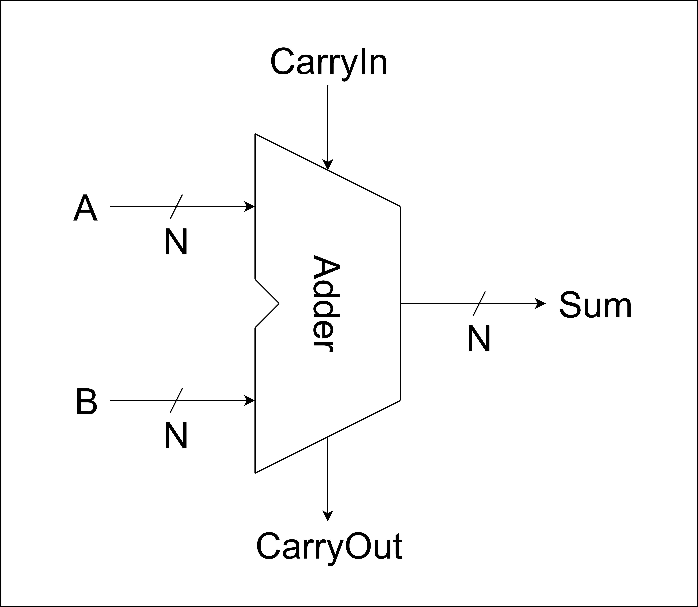

# RV32I Processor Verilog Design

Welcome to **RV32I Processor Verilog Design**!

This project is aimed to reproduce the design process of RISC-V Architecture.  
In the scope of this project, single-cycle processor is prefered to achieve the most simple approach.

## **1. Datapath Component**

### **1.1. Combinational Elements**

#### ***1.1.1. Adder***

